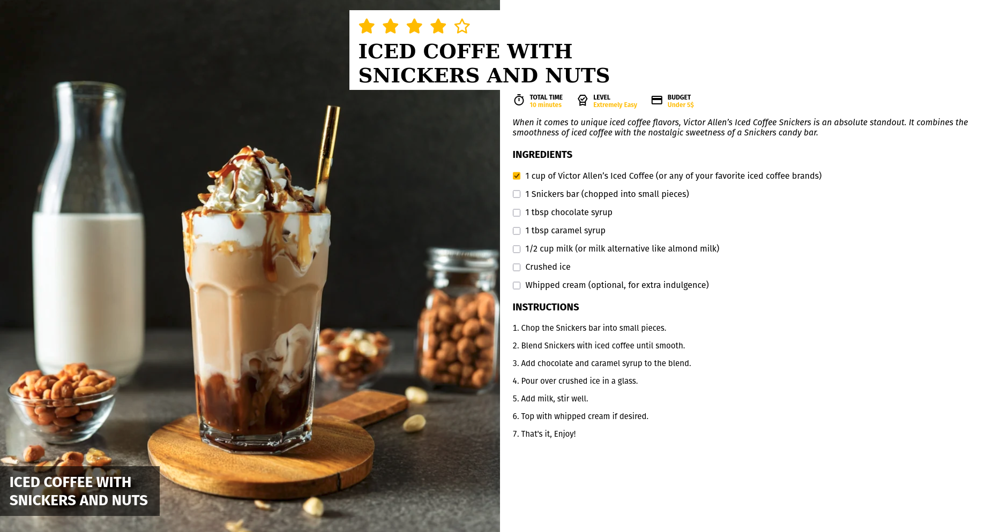

# DAY #3

Recipe - This is a simple coffee recipe page. Through this project, I practiced CSS positioning, layout techniques, and enhancing user experience with responsive design. There’s still plenty to improve, but it’s a solid start.

# Screenshot
Here is the screenshot for this challenge

